# Architecture Document — AI Patient DBMS

**Version:** 1.0
**Status:** Draft
**Last Updated:** 2026-08-10
**Owner:** Engineering Team

---

## 1. High-Level System Architecture

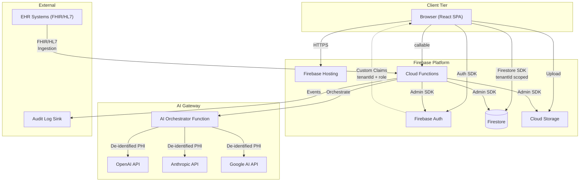

### Architecture Principles

1. **Client is thin.** The browser performs CRUD via Firestore SDK and invokes Cloud Functions for server-trusted operations (AI, FHIR conversion, audit ingestion, cross-tenant operations).
2. **Firestore is the single source of truth.** No secondary database. All structured and semi-structured data lives in Firestore documents and sub-collections.
3. **AI flows through Cloud Functions.** The client never calls AI providers directly. AI calls are proxied through Cloud Functions for PHI protection, API key management, and audit logging.
4. **Multi-tenancy is enforced at every tier.** Data tier (Firestore rules), logic tier (repository filters), and identity tier (auth custom claims).
5. **Everything is serverless.** No long-running servers. Cloud Functions handle all backend logic. Firestore scales automatically.

---

## 2. Frontend Architecture

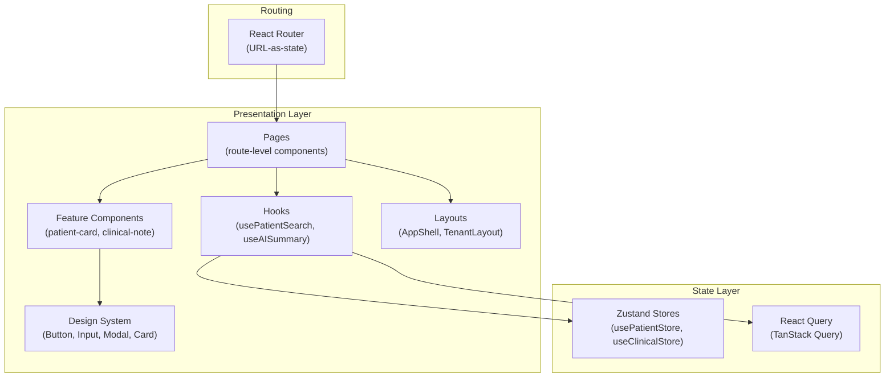

### 2.1 Technology Stack

| Concern   | Technology                     | Rationale                                            |
| --------- | ------------------------------ | ---------------------------------------------------- |
| Framework | React 19+                      | Component model, ecosystem, team familiarity         |
| Language  | TypeScript (strict)            | Type safety, maintainability                         |
| Bundler   | Vite                           | Fast dev server, optimized builds, ESM-native        |
| Routing   | React Router 7                 | Nested routes, loaders, URL-as-state                 |
| Styling   | Tailwind CSS                   | Utility-first, design system alignment, tree-shaking |
| Forms     | React Hook Form + Zod          | Performant forms with schema validation              |
| Testing   | Vitest + React Testing Library | Fast, modern, component-testing focused              |
| E2E       | Playwright                     | Cross-browser, reliable, CI-friendly                 |

### 2.2 Component Architecture

```
Component Hierarchy:
  AppShell
  ├── TenantGuard (validates tenantId in auth claims)
  ├── Sidebar (tenant-scoped navigation)
  ├── Header (user menu, tenant selector, search bar)
  └── <Outlet> (route-specific content)
      ├── PatientListPage
      │   ├── PatientSearchBar
      │   ├── PatientTable
      │   └── PatientCard (per row)
      ├── PatientDetailPage
      │   ├── PatientHeader (demographics, vitals)
      │   ├── PatientTimeline (chronological feed)
      │   ├── ClinicalNoteEditor
      │   │   ├── SOAPForm
      │   │   └── AISummarizeButton
      │   └── TabSet (Notes, Meds, Labs, Allergies)
      └── AdminPage
          ├── UserManagement
          ├── TenantSettings
          └── AuditLogViewer
```

### 2.3 Route Design

```
/                             → redirect to /:tenantId/patients
/:tenantId                    → TenantGuard → AppShell
/:tenantId/patients           → PatientListPage
/:tenantId/patients/:id       → PatientDetailPage
/:tenantId/patients/:id/notes/:noteId → ClinicalNoteEditor
/:tenantId/admin              → AdminPage (role-gated)
/:tenantId/admin/users        → UserManagement
/:tenantId/admin/settings     → TenantSettings
/:tenantId/admin/audit        → AuditLogViewer
```

---

## 3. Backend Architecture

The backend is composed entirely of Firebase Cloud Functions. There is no traditional server.

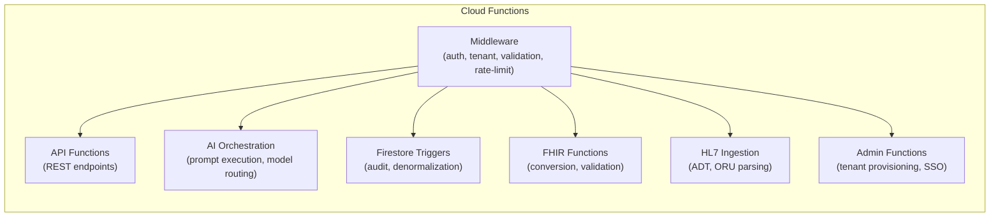

### 3.1 Function Taxonomy

| Category      | Trigger          | Examples                                           | Auth Level            |
| ------------- | ---------------- | -------------------------------------------------- | --------------------- |
| **API**       | HTTP (callable)  | `getPatient`, `searchPatients`, `createNote`       | User token            |
| **AI**        | HTTP (callable)  | `generateSummary`, `suggestCodes`                  | User token            |
| **Triggers**  | Firestore events | `onNoteWrite` → audit, `onPatientUpdate` → reindex | Admin SDK             |
| **FHIR**      | HTTP (onRequest) | `GET /fhir/Patient/:id`                            | API key or user token |
| **Ingestion** | HTTP (onRequest) | `POST /ingest/hl7`                                 | API key               |
| **Admin**     | HTTP (callable)  | `provisionTenant`, `inviteUser`                    | Super-admin token     |

---

## 4. Firebase Services

| Service                     | Purpose                                          | Configuration                                             |
| --------------------------- | ------------------------------------------------ | --------------------------------------------------------- |
| **Firestore**               | Primary database for all structured data         | Multi-region (nam5), composite indexes for all queries    |
| **Firebase Auth**           | User authentication, MFA, custom claims          | Email/password, tenantId + role in claims                 |
| **Cloud Functions**         | All backend logic (API, AI, triggers, ingestion) | Node.js 20, 2nd gen functions, secrets via Secret Manager |
| **Cloud Storage**           | File attachments (documents, images, exports)    | Security rules matching Firestore tenant isolation        |
| **Firebase Hosting**        | Static asset serving for React SPA               | CDN-backed, custom domain, HTTP/2                         |
| **Secret Manager**          | API keys, provider credentials, signing keys     | Accessed via Cloud Functions only                         |
| **Firebase Emulator Suite** | Local development and testing                    | Auth, Firestore, Functions, Storage                       |

---

## 5. Cloud Functions Architecture

### 5.1 Function Structure

Each Cloud Function is a thin controller that delegates to application-layer services:

```
functions/src/
├── api/
│   ├── patient/
│   │   ├── searchPatients.function.ts
│   │   ├── getPatient.function.ts
│   │   └── createPatient.function.ts
│   ├── clinical/
│   │   ├── createNote.function.ts
│   │   └── updateNote.function.ts
│   └── tenant/
│       ├── getTenantConfig.function.ts
│       └── inviteUser.function.ts
├── ai/
│   ├── generateSummary.function.ts
│   ├── suggestCodes.function.ts
│   └── orchestrateAIInference.function.ts
├── triggers/
│   ├── onNoteWrite.function.ts
│   ├── onPatientUpdate.function.ts
│   └── onAuditLogCreate.function.ts
├── fhir/
│   └── fhirEndpoint.function.ts
├── ingestion/
│   └── hl7Ingestion.function.ts
├── admin/
│   ├── provisionTenant.function.ts
│   └── configureTenant.function.ts
└── middleware/
    ├── auth.middleware.ts
    ├── tenant.middleware.ts
    ├── validation.middleware.ts
    └── rateLimit.middleware.ts
```

### 5.2 Function Invocation Patterns

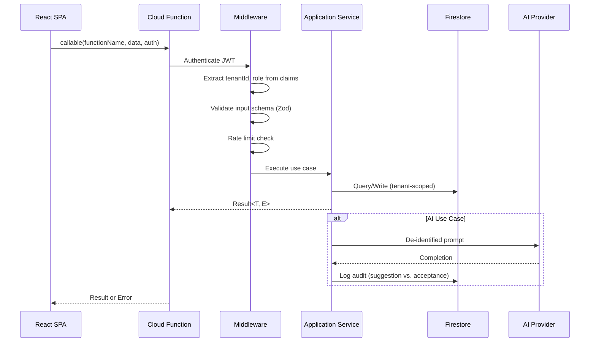

---

## 6. AI Gateway Architecture

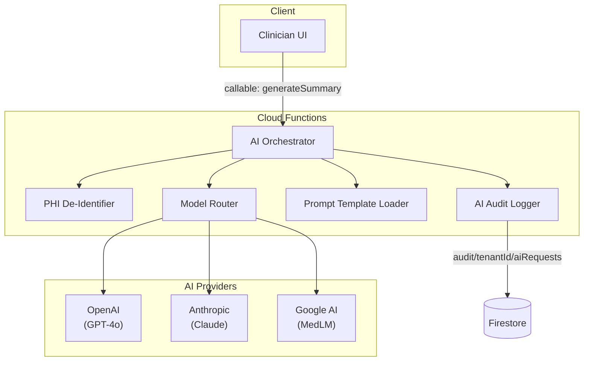

### 6.1 Model Routing Rules

| Use Case               | Primary Model          | Fallback          | Criteria                           |
| ---------------------- | ---------------------- | ----------------- | ---------------------------------- |
| Note summarization     | GPT-4o                 | Claude 3.5 Sonnet | Accuracy, structured output        |
| ICD-10 coding          | GPT-4o                 | Claude 3.5 Sonnet | Code accuracy, specificity         |
| Differential diagnosis | MedLM                  | GPT-4o            | Clinical safety, evidence citation |
| Semantic search        | text-embedding-3-large | Gecko embeddings  | Embedding quality, cost            |
| Discharge summary      | Claude 3.5 Sonnet      | GPT-4o            | Long-form coherence                |
| Voice-to-note          | Whisper → GPT-4o       | —                 | Pipeline reliability               |

### 6.2 PHI De-Identification Pipeline

Before any clinical text leaves the Cloud Function boundary:

1. **Named Entity Recognition:** Identify PHI entities (names, dates, locations, identifiers).
2. **Surrogate Replacement:** Replace PHI with typed placeholders (`[PATIENT_NAME]`, `[DATE:YYYY-MM-DD]`).
3. **Mapping Storage:** Store the mapping in Firestore (encrypted) for re-identification on return.
4. **Audit Log:** Record that a de-identified request was sent, including model, prompt version, and token count.

---

## 7. Authentication & Authorization

### 7.1 Identity Flow

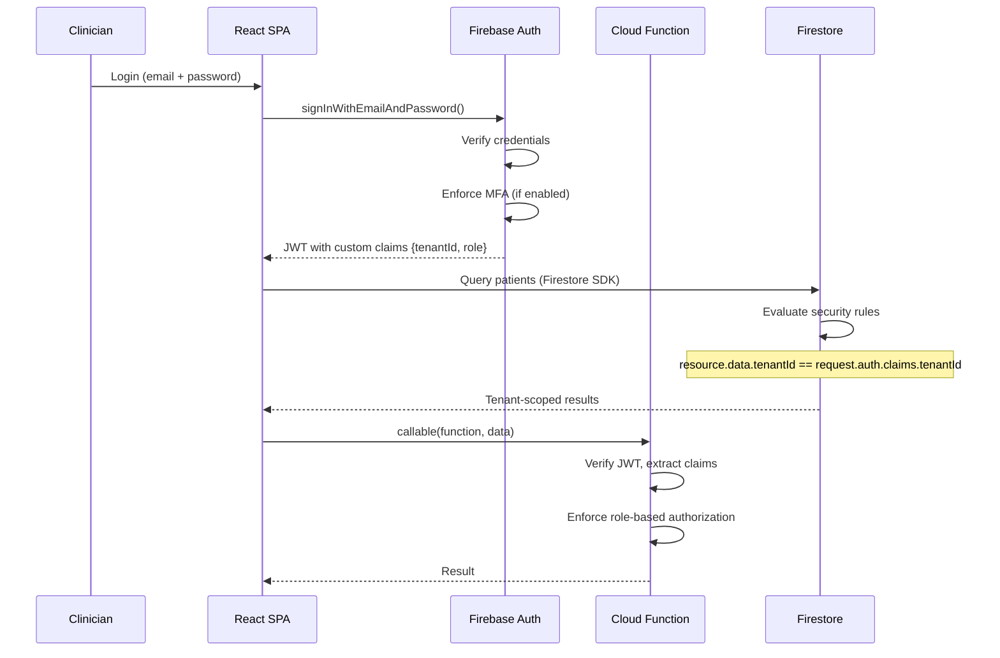

### 7.2 Role-Based Access Control

| Role             | Permissions                                                                         |
| ---------------- | ----------------------------------------------------------------------------------- |
| **Super-Admin**  | Provision tenants, manage global config, view all audit logs (Cloud Functions only) |
| **Tenant Admin** | Manage users, configure tenant settings, view tenant audit logs, export data        |
| **Provider**     | Create/edit patients, write clinical notes, use AI features, view patient records   |
| **Nurse**        | View assigned patients, record vitals, document observations                        |
| **Viewer**       | Read-only access to assigned patient records                                        |

### 7.3 Custom Claims Structure

```json
{
  "tenantId": "tenant_abc123",
  "role": "provider",
  "permissions": ["patient:read", "patient:write", "note:read", "note:write", "ai:summarize"],
  "tenantName": "Riverdale Family Medicine"
}
```

---

## 8. Multi-Tenant Design

### 8.1 Isolation Enforcement

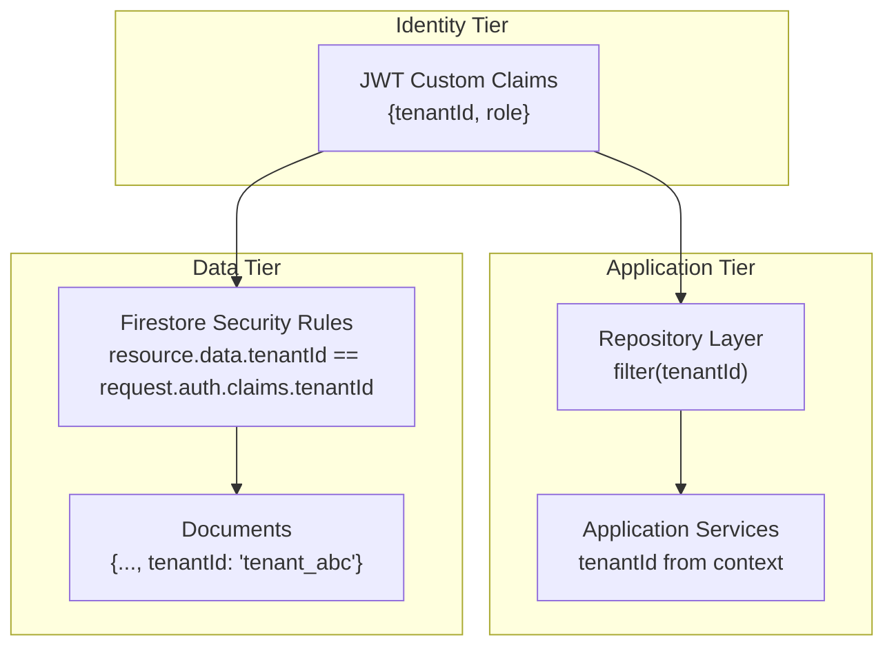

### 8.2 Tenant Document Model

```
tenants/{tenantId}
├── config            (Feature flags, branding, AI model preferences, retention policies)
├── users/            (Sub-collection of tenant-scoped user profiles)
│   └── {userId}
└── audit/            (Append-only sub-collection of audit log entries)
    └── {auditEntryId}
```

### 8.3 Cross-Tenant Sharing (V5)

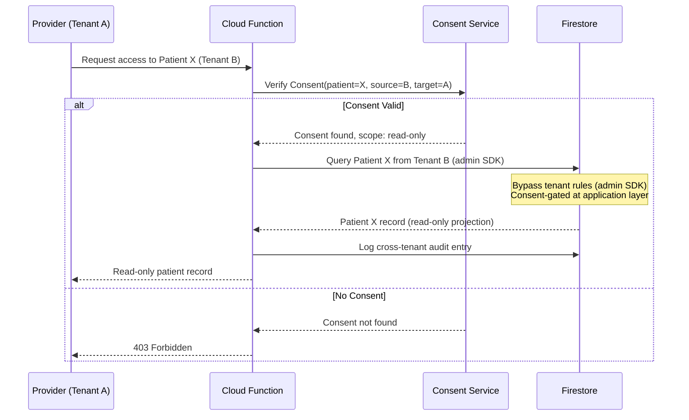

---

## 9. Firestore Data Model

### 9.1 Core Collections

```
patients/{patientId}
├── demographics:       {firstName, lastName, dob, gender, mrn, ...}
├── contact:            {phone, email, address}
├── tenantId:           "tenant_abc"
├── createdAt:          Timestamp
├── updatedAt:          Timestamp
├── visits/             (sub-collection)
│   └── {visitId}
│       ├── date:       Timestamp
│       ├── providerId: "user_xyz"
│       ├── type:       "in-person" | "telehealth"
│       ├── reason:     string
│       ├── tenantId:   "tenant_abc"
│       └── notes/      (sub-collection)
│           └── {noteId}
│               ├── type:         "soap" | "progress" | "discharge"
│               ├── subjective:   string
│               ├── objective:    string
│               ├── assessment:   string
│               ├── plan:         string
│               ├── authorId:     "user_xyz"
│               ├── aiAssisted:   boolean
│               ├── aiSuggestion: {promptVersion, rawOutput, acceptedEdits}
│               ├── tenantId:     "tenant_abc"
│               └── createdAt:    Timestamp
├── medications/        (sub-collection)
│   └── {medId}
│       ├── name, dosage, frequency, route, prescribingProvider, tenantId
├── allergies/          (sub-collection)
│   └── {allergyId}
│       ├── substance, reaction, severity, recordedDate, tenantId
├── labResults/         (sub-collection)
│   └── {labId}
│       ├── loincCode, value, unit, referenceRange, collectionDate, tenantId
├── diagnoses/          (sub-collection)
│   └── {diagnosisId}
│       ├── icd10Code, description, diagnosedDate, status, tenantId
└── attachments/        (sub-collection)
    └── {attachmentId}
        ├── fileName, storageRef, mimeType, uploadedBy, tenantId
```

```
tenants/{tenantId}
├── name, tier, status, createdAt
├── config: {features, branding, aiPreferences, retentionPolicy}
├── billingId
└── users/              (sub-collection)
    └── {userId}
        ├── email, displayName, role
        └── tenantId (redundant for rules)
```

```
audit/{tenantId}/{auditEntryId}
├── action:        "patient.read" | "note.create" | "ai.summarize" | "cross-tenant.access"
├── resourceType:  "patient" | "note" | "attachment"
├── resourceId:    "patient_abc"
├── userId:        "user_xyz"
├── tenantId:      "tenant_abc"
├── timestamp:     Timestamp
├── outcome:       "success" | "denied" | "error"
├── metadata:      {ip, userAgent, sessionId, ...}
└── aiContext:     {suggestionId, accepted, editDistance}  // For AI actions
```

```
consents/{consentId}
├── patientId:     "patient_abc"
├── sourceTenant:  "tenant_A"
├── targetTenant:  "tenant_B"
├── scope:         "read" | "read-write"
├── dataTypes:     ["notes", "medications", "allergies"]
├── grantedAt:     Timestamp
├── expiresAt:     Timestamp | null
├── revokedAt:     Timestamp | null
└── status:        "active" | "expired" | "revoked"
```

### 9.2 Indexing Strategy

```json
{
  "indexes": [
    {
      "collectionGroup": "patients",
      "queryScope": "COLLECTION",
      "fields": [
        { "fieldPath": "tenantId", "order": "ASCENDING" },
        { "fieldPath": "lastName", "order": "ASCENDING" },
        { "fieldPath": "firstName", "order": "ASCENDING" }
      ]
    },
    {
      "collectionGroup": "patients",
      "queryScope": "COLLECTION",
      "fields": [
        { "fieldPath": "tenantId", "order": "ASCENDING" },
        { "fieldPath": "mrn", "order": "ASCENDING" }
      ]
    },
    {
      "collectionGroup": "visits",
      "queryScope": "COLLECTION",
      "fields": [
        { "fieldPath": "tenantId", "order": "ASCENDING" },
        { "fieldPath": "date", "order": "DESCENDING" }
      ]
    },
    {
      "collectionGroup": "audit",
      "queryScope": "COLLECTION",
      "fields": [
        { "fieldPath": "tenantId", "order": "ASCENDING" },
        { "fieldPath": "timestamp", "order": "DESCENDING" }
      ]
    }
  ]
}
```

### 9.3 Data Access Patterns

| Query                          | Pattern                                                                                   | Index                           |
| ------------------------------ | ----------------------------------------------------------------------------------------- | ------------------------------- |
| Search patients by name        | `patients.where(tenantId).where(lastName >= prefix).where(lastName <= prefix + '\uf8ff')` | tenantId + lastName + firstName |
| Search patients by MRN         | `patients.where(tenantId).where(mrn, '==', mrn)`                                          | tenantId + mrn                  |
| List recent visits for patient | `patients/{id}/visits.where(tenantId).orderBy(date, 'desc').limit(20)`                    | tenantId + date DESC            |
| List notes for visit           | `patients/{id}/visits/{vid}/notes.where(tenantId).orderBy(createdAt, 'desc')`             | tenantId + createdAt DESC       |
| Audit log for tenant           | `audit/{tenantId}.orderBy(timestamp, 'desc').limit(100)`                                  | tenantId + timestamp DESC       |

---

## 10. Storage Structure

```
gs://{project}.appspot.com/
├── tenants/
│   └── {tenantId}/
│       ├── attachments/
│       │   └── {patientId}/
│       │       └── {attachmentId}_{fileName}
│       ├── exports/
│       │   └── {exportId}_{timestamp}.fhir.json
│       └── imports/
│           └── {importId}_{timestamp}.csv
├── ai-cache/
│   └── {tenantId}/
│       └── {hashOfPrompt}_{model}.json   (cached AI responses for identical inputs)
└── temp/
    └── {uploadSessionId}/
```

### Storage Security Rules

```
rules_version = '2';
service firebase.storage {
  match /b/{bucket}/o {
    match /tenants/{tenantId}/{allPaths=**} {
      allow read, write: if request.auth != null
        && request.auth.token.tenantId == tenantId;
    }
    match /ai-cache/{tenantId}/{allPaths=**} {
      allow read: if request.auth != null
        && request.auth.token.tenantId == tenantId;
      allow write: if false;  // Cloud Functions only
    }
    match /temp/{uploadSessionId} {
      allow read, write: if request.auth != null
        && request.auth.token.uid == string(request.resource.metadata.uploader);
      allow write: if request.auth != null;
    }
  }
}
```

---

## 11. Security Architecture

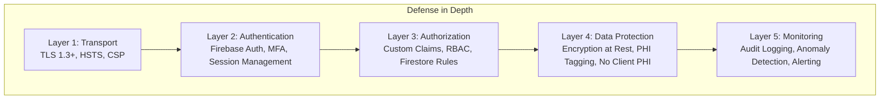

### 11.1 Threat Model Summary

| Threat                          | Mitigation                                                      |
| ------------------------------- | --------------------------------------------------------------- |
| Unauthorized data access        | Tenant-scoped Firestore rules, auth custom claims, RBAC         |
| Cross-tenant data leakage       | Three-tier enforcement (identity, application, data)            |
| Token theft / session hijacking | Short-lived tokens, MFA, session timeout (15 min inactivity)    |
| PHI exposure in logs            | No PHI in client-side console, error reports, or analytics      |
| API key leakage                 | Secrets in Firebase Secret Manager, never in client bundle      |
| SQL injection                   | Not applicable (Firestore is NoSQL); input validation via Zod   |
| XSS / CSRF                      | React auto-escaping, CSP headers, CSRF tokens via Firebase Auth |
| AI prompt injection             | Input sanitization, strict output parsing, prompt hardening     |
| Insider threat                  | Immutable audit logs, role-based access, separation of duties   |

### 11.2 Firestore Security Rules (Excerpt)

```
rules_version = '2';
service cloud.firestore {
  match /databases/{database}/documents {

    function isAuthenticated() {
      return request.auth != null;
    }

    function tenantId() {
      return request.auth.token.tenantId;
    }

    function belongsToTenant(tenantId) {
      return resource.data.tenantId == tenantId;
    }

    function hasRole(role) {
      return request.auth.token.role == role;
    }

    function hasPermission(perm) {
      return perm in request.auth.token.permissions;
    }

    // Patients
    match /patients/{patientId} {
      allow read: if isAuthenticated() && belongsToTenant(tenantId());
      allow create: if isAuthenticated()
        && request.resource.data.tenantId == tenantId()
        && hasPermission('patient:write');
      allow update: if isAuthenticated()
        && belongsToTenant(tenantId())
        && hasPermission('patient:write');
      allow delete: if false;  // Soft delete via update (archived: true)
    }

    // Visits (sub-collection)
    match /patients/{patientId}/visits/{visitId} {
      allow read: if isAuthenticated()
        && get(/databases/$(database)/documents/patients/$(patientId)).data.tenantId == tenantId();
      allow write: if isAuthenticated()
        && hasPermission('note:write')
        && request.resource.data.tenantId == tenantId();
    }

    // Audit log — append-only, no delete
    match /audit/{tenantId}/{auditEntryId} {
      allow read: if isAuthenticated()
        && tenantId() == tenantId
        && (hasRole('admin') || hasRole('super-admin'));
      allow create: if isAuthenticated()
        && request.resource.data.tenantId == tenantId;
      allow update, delete: if false;
    }

    // Tenant config — admin only
    match /tenants/{tenantId} {
      allow read: if isAuthenticated() && tenantId() == tenantId;
      allow write: if false;  // Cloud Functions only
    }

    match /tenants/{tenantId}/users/{userId} {
      allow read: if isAuthenticated() && tenantId() == tenantId;
      allow write: if isAuthenticated()
        && tenantId() == tenantId
        && hasRole('admin');
    }
  }
}
```

---

## 12. API Boundaries

### 12.1 Internal API (Cloud Functions Callables)

| Function            | Auth  | Input                         | Output                   |
| ------------------- | ----- | ----------------------------- | ------------------------ |
| `searchPatients`    | User  | `{query, filters}`            | `Patient[]`              |
| `getPatient`        | User  | `{patientId}`                 | `Patient`                |
| `createPatient`     | User  | `{demographics, contact}`     | `Patient`                |
| `updatePatient`     | User  | `{patientId, patches}`        | `Patient`                |
| `createNote`        | User  | `{patientId, visitId, soap}`  | `ClinicalNote`           |
| `updateNote`        | User  | `{noteId, patches}`           | `ClinicalNote`           |
| `generateSummary`   | User  | `{noteText, patientContext?}` | `{soap, suggestedCodes}` |
| `suggestCodes`      | User  | `{clinicalText}`              | `{codes: ICD10[]}`       |
| `inviteUser`        | Admin | `{email, role}`               | `{userId}`               |
| `exportPatientData` | Admin | `{patientId, format}`         | `{downloadUrl}`          |

### 12.2 External API (FHIR R4 — V3)

| Endpoint                | Method    | Auth                    |
| ----------------------- | --------- | ----------------------- |
| `/fhir/Patient`         | GET, POST | API key + tenant header |
| `/fhir/Patient/{id}`    | GET, PUT  | API key + tenant header |
| `/fhir/Observation`     | GET, POST | API key + tenant header |
| `/fhir/Encounter`       | GET, POST | API key + tenant header |
| `/fhir/Condition`       | GET, POST | API key + tenant header |
| `/fhir/Patient/$export` | GET       | API key + tenant header |

### 12.3 API Key Management

- API keys are tenant-scoped and generated by tenant admins.
- Keys are stored hashed in Firestore under `tenants/{tenantId}/apiKeys/`.
- Rate limiting is enforced in Cloud Function middleware (configurable per tier).
- Key rotation is supported; old keys can be revoked without rotation downtime.

---

## 13. State Management

### 13.1 State Architecture

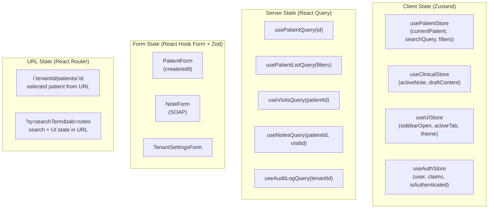

### 13.2 State Ownership Rules

- **URL owns navigation state.** Patient ID, active tab, and search query are in the URL. Deep links work.
- **Zustand owns transient UI state.** Sidebar state, draft content (auto-saved to Firestore periodically), and ephemeral UI flags.
- **React Query owns server data.** All Firestore reads go through query hooks with caching, background refetching, and optimistic updates.
- **React Hook Form owns form state.** Form state is local to the form and validated with Zod schemas before submission.

---

## 14. Folder Structure

```
ai-patient-dbms/
├── src/
│   ├── domain/                          # Entities, value objects, domain services
│   │   ├── patient/
│   │   │   ├── Patient.ts               # Patient aggregate root
│   │   │   ├── PatientId.ts             # Value object
│   │   │   ├── Demographics.ts          # Value object
│   │   │   ├── Contact.ts               # Value object
│   │   │   ├── PatientRepository.ts     # Repository interface (port)
│   │   │   └── index.ts                 # Public barrel
│   │   ├── clinical/
│   │   │   ├── ClinicalNote.ts          # Aggregate root
│   │   │   ├── NoteId.ts                # Value object
│   │   │   ├── SOAPSection.ts           # Value object
│   │   │   ├── DiagnosisCode.ts         # Value object (ICD-10)
│   │   │   ├── Visit.ts                 # Aggregate root
│   │   │   ├── ClinicalRepository.ts    # Repository interface
│   │   │   └── index.ts
│   │   ├── tenant/
│   │   │   ├── Tenant.ts                # Aggregate root
│   │   │   ├── TenantId.ts              # Value object
│   │   │   ├── TenantConfig.ts          # Value object
│   │   │   ├── TenantRepository.ts      # Repository interface
│   │   │   └── index.ts
│   │   ├── auth/
│   │   │   ├── User.ts                  # Aggregate root
│   │   │   ├── Role.ts                  # Enum value object
│   │   │   ├── Permission.ts            # Value object
│   │   │   ├── AuthRepository.ts        # Repository interface
│   │   │   └── index.ts
│   │   ├── consent/
│   │   │   ├── Consent.ts               # Aggregate root (V5)
│   │   │   ├── ConsentRepository.ts     # Repository interface (V5)
│   │   │   └── index.ts
│   │   └── shared/
│   │       ├── Result.ts                # Result<T, E> type
│   │       ├── AuditEntry.ts            # Value object
│   │       ├── TenantScoped.ts          # Base type for tenant-scoped entities
│   │       ├── ValidationError.ts       # Domain error types
│   │       └── index.ts
│   ├── application/                     # Use cases, state management, ports
│   │   ├── patient/
│   │   │   ├── SearchPatients.ts        # Use case
│   │   │   ├── GetPatient.ts            # Use case
│   │   │   ├── CreatePatient.ts         # Use case
│   │   │   ├── UpdatePatient.ts         # Use case
│   │   │   └── index.ts
│   │   ├── clinical/
│   │   │   ├── CreateNote.ts            # Use case
│   │   │   ├── UpdateNote.ts            # Use case
│   │   │   ├── GetPatientTimeline.ts    # Use case
│   │   │   └── index.ts
│   │   ├── ai/
│   │   │   ├── GenerateSummary.ts       # Use case
│   │   │   ├── SuggestCodes.ts          # Use case
│   │   │   ├── SummarizePatientRecord.ts # Use case
│   │   │   └── index.ts
│   │   ├── tenant/
│   │   │   ├── ProvisionTenant.ts       # Use case (Cloud Functions)
│   │   │   ├── InviteUser.ts            # Use case
│   │   │   ├── ConfigureTenant.ts       # Use case
│   │   │   └── index.ts
│   │   └── ports/                       # Interfaces for infrastructure
│   │       ├── IPatientRepository.ts
│   │       ├── IClinicalRepository.ts
│   │       ├── ITenantRepository.ts
│   │       ├── IAuthRepository.ts
│   │       ├── IAIModelProvider.ts
│   │       ├── IAuditLogger.ts
│   │       ├── IEncryptionService.ts
│   │       └── index.ts
│   ├── infrastructure/                  # Firebase, AI providers, encryption
│   │   ├── firebase/
│   │   │   ├── FirestorePatientRepository.ts
│   │   │   ├── FirestoreClinicalRepository.ts
│   │   │   ├── FirestoreTenantRepository.ts
│   │   │   ├── FirebaseAuthRepository.ts
│   │   │   ├── FirestoreAuditLogger.ts
│   │   │   └── index.ts
│   │   ├── ai/
│   │   │   ├── OpenAIProvider.ts
│   │   │   ├── AnthropicProvider.ts
│   │   │   ├── GoogleAIProvider.ts
│   │   │   ├── ModelRouter.ts
│   │   │   ├── PHIDeidentifier.ts
│   │   │   └── index.ts
│   │   ├── encryption/
│   │   │   ├── AESEncryptionService.ts
│   │   │   └── index.ts
│   │   └── http/
│   │       ├── FHIRClient.ts
│   │       └── index.ts
│   ├── presentation/                    # React components, pages, hooks
│   │   ├── components/
│   │   │   ├── PatientCard.tsx
│   │   │   ├── PatientSearchBar.tsx
│   │   │   ├── PatientTimeline.tsx
│   │   │   ├── ClinicalNoteEditor.tsx
│   │   │   ├── AISummarizeButton.tsx
│   │   │   ├── AuditLogTable.tsx
│   │   │   ├── TenantGuard.tsx
│   │   │   └── UserMenu.tsx
│   │   ├── pages/
│   │   │   ├── patients/
│   │   │   │   ├── PatientListPage.tsx
│   │   │   │   ├── PatientDetailPage.tsx
│   │   │   │   └── PatientCreatePage.tsx
│   │   │   ├── clinical/
│   │   │   │   └── NoteEditorPage.tsx
│   │   │   └── admin/
│   │   │       ├── AdminDashboardPage.tsx
│   │   │       ├── UserManagementPage.tsx
│   │   │       ├── TenantSettingsPage.tsx
│   │   │       └── AuditLogPage.tsx
│   │   ├── hooks/
│   │   │   ├── usePatientSearch.ts
│   │   │   ├── usePatientDetail.ts
│   │   │   ├── useClinicalSummary.ts
│   │   │   ├── useAISummarize.ts
│   │   │   ├── useAuditLog.ts
│   │   │   └── useTenantConfig.ts
│   │   ├── layouts/
│   │   │   ├── AppShell.tsx
│   │   │   ├── TenantLayout.tsx
│   │   │   └── AuthLayout.tsx
│   │   └── design-system/
│   │       ├── Button.tsx
│   │       ├── Input.tsx
│   │       ├── Modal.tsx
│   │       ├── Card.tsx
│   │       ├── Table.tsx
│   │       ├── Tabs.tsx
│   │       ├── Badge.tsx
│   │       ├── Toast.tsx
│   │       └── Spinner.tsx
│   ├── ai/                              # AI: prompt templates, model configs, pipelines
│   │   ├── prompts/
│   │   │   ├── summarize-note.v1.txt
│   │   │   ├── suggest-codes.v1.txt
│   │   │   ├── differential-diagnosis.v1.txt
│   │   │   └── discharge-summary.v1.txt
│   │   ├── models/
│   │   │   ├── model-config.ts
│   │   │   └── model-routing.ts
│   │   ├── pipelines/
│   │   │   ├── summarization-pipeline.ts
│   │   │   └── coding-pipeline.ts
│   │   └── evaluation/
│   │       ├── summarize-note.eval.ts
│   │       ├── suggest-codes.eval.ts
│   │       └── fixtures/
│   │           └── clinical-notes.json
│   ├── lib/                             # Shared utilities
│   │   ├── formatDate.ts
│   │   ├── debounce.ts
│   │   └── typeGuards.ts
│   ├── test/                            # Test utilities
│   │   ├── factories/
│   │   │   ├── patientFactory.ts
│   │   │   ├── noteFactory.ts
│   │   │   └── tenantFactory.ts
│   │   ├── mocks/
│   │   │   ├── mockPatientRepository.ts
│   │   │   ├── mockAIProvider.ts
│   │   │   └── mockAuthRepository.ts
│   │   └── fixtures/
│   │       └── sampleData.ts
│   └── config/                          # Environment, feature flags
│       ├── env.ts
│       ├── featureFlags.ts
│       └── constants.ts
├── functions/                           # Firebase Cloud Functions
│   ├── src/
│   │   ├── api/
│   │   │   ├── patient/
│   │   │   │   ├── searchPatients.function.ts
│   │   │   │   ├── getPatient.function.ts
│   │   │   │   ├── createPatient.function.ts
│   │   │   │   └── updatePatient.function.ts
│   │   │   ├── clinical/
│   │   │   │   ├── createNote.function.ts
│   │   │   │   ├── updateNote.function.ts
│   │   │   │   └── getTimeline.function.ts
│   │   │   └── tenant/
│   │   │       ├── inviteUser.function.ts
│   │   │       └── getConfig.function.ts
│   │   ├── ai/
│   │   │   ├── generateSummary.function.ts
│   │   │   ├── suggestCodes.function.ts
│   │   │   └── orchestrateInference.function.ts
│   │   ├── triggers/
│   │   │   ├── onNoteWrite.function.ts
│   │   │   ├── onPatientUpdate.function.ts
│   │   │   └── onAuditLogCreate.function.ts
│   │   ├── fhir/
│   │   │   └── fhirEndpoint.function.ts
│   │   ├── ingestion/
│   │   │   └── hl7Ingestion.function.ts
│   │   ├── admin/
│   │   │   ├── provisionTenant.function.ts
│   │   │   └── configureTenant.function.ts
│   │   └── middleware/
│   │       ├── auth.middleware.ts
│   │       ├── tenant.middleware.ts
│   │       ├── validation.middleware.ts
│   │       └── rateLimit.middleware.ts
│   ├── package.json
│   └── tsconfig.json
├── firestore/
│   ├── firestore.rules
│   ├── firestore.indexes.json
│   └── schema/
│       └── firestore.schema.md
├── storage/
│   └── storage.rules
├── docs/
│   ├── PRD.md
│   ├── ARCHITECTURE.md
│   ├── ROADMAP.md
│   └── DECISIONS.md
├── e2e/
│   ├── patient-search.spec.ts
│   ├── clinical-note.spec.ts
│   └── tenant-isolation.spec.ts
├── .github/
│   └── workflows/
│       ├── ci.yml
│       └── deploy.yml
├── AGENTS.md
├── README.md
├── package.json
├── tsconfig.json
├── vite.config.ts
├── tailwind.config.ts
├── .env.example
└── .gitignore
```

---

## 15. Error Handling Strategy

### 15.1 Error Types

```typescript
// Domain errors — returned as Result<T, E>, never thrown
type DomainError =
  | { type: "NotFound"; entity: string; id: string }
  | { type: "ValidationError"; field: string; message: string }
  | { type: "Unauthorized"; action: string }
  | { type: "TenantMismatch"; expected: TenantId; actual: TenantId }
  | { type: "ConsentRequired"; patientId: PatientId; targetTenant: TenantId };

// Infrastructure errors — thrown (network, Firestore unavailable, AI timeout)
type InfrastructureError =
  | { type: "NetworkError"; cause: unknown }
  | { type: "FirestoreError"; code: string; message: string }
  | { type: "AITimeout"; model: string; elapsedMs: number }
  | { type: "RateLimited"; retryAfter: number };
```

### 15.2 Error Flow

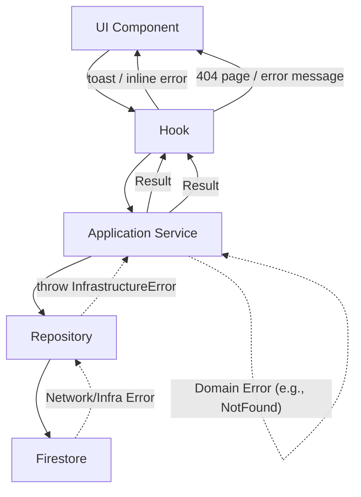

### 15.3 Client-Side Error Boundaries

- `TenantErrorBoundary`: Catches tenant-isolation failures, shows "Access Denied" with contact admin prompt.
- `AIErrorBoundary`: Catches AI inference failures, shows fallback UI with retry button.
- `GlobalErrorBoundary`: Catches unhandled errors, shows generic error page with session recovery option.

---

## 16. Logging & Monitoring

### 16.1 Logging Strategy

| Layer              | What to Log                                       | Where                                          | Notes                  |
| ------------------ | ------------------------------------------------- | ---------------------------------------------- | ---------------------- |
| Client             | Navigation events, user actions, error boundaries | Cloud Logging (via Firebase)                   | No PHI                 |
| Cloud Functions    | Function invocations, durations, errors           | Cloud Logging                                  | Structured JSON        |
| Firestore Triggers | Document changes, trigger outcomes                | Cloud Logging                                  | eventId, document path |
| AI Gateway         | Model calls, token count, latency, prompt version | Firestore (`audit/aiRequests`) + Cloud Logging | De-identified          |
| Audit              | PHI access and modification                       | Firestore (`audit/{tenantId}`)                 | Immutable, append-only |

### 16.2 Monitoring Stack

| Concern                 | Tool                                                                     |
| ----------------------- | ------------------------------------------------------------------------ |
| Uptime & availability   | Google Cloud Monitoring (Uptime Checks)                                  |
| Error tracking          | Google Cloud Error Reporting                                             |
| Performance (client)    | Firebase Performance Monitoring                                          |
| Performance (functions) | Cloud Functions metrics (invocations, latency, memory)                   |
| AI performance          | Custom Cloud Monitoring metrics (latency, success rate, acceptance rate) |
| Security events         | Cloud Logging + Alerting for Firestore rule denials, auth failures       |
| Cost monitoring         | Google Cloud Billing alerts + per-tenant cost attribution                |

### 16.3 Alerting Rules

| Alert                               | Threshold       | Severity |
| ----------------------------------- | --------------- | -------- |
| Function error rate > 1%            | 5-minute window | Critical |
| AI function latency (p95) > 7s      | 5-minute window | Warning  |
| Firestore rule denial spike         | 10x baseline    | Critical |
| Auth failure spike                  | 5x baseline     | Warning  |
| Cross-tenant access without consent | Any occurrence  | Critical |
| PHI detected in client-side logs    | Any occurrence  | Critical |

---

## 17. Deployment Architecture

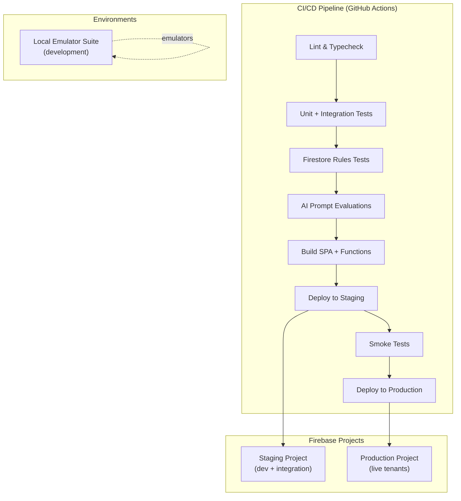

### 17.1 Deployment Targets

| Artifact          | Target                    | Command                                    |
| ----------------- | ------------------------- | ------------------------------------------ |
| React SPA         | Firebase Hosting          | `firebase deploy --only hosting`           |
| Cloud Functions   | Cloud Functions (2nd gen) | `firebase deploy --only functions`         |
| Firestore Rules   | Firestore                 | `firebase deploy --only firestore:rules`   |
| Firestore Indexes | Firestore                 | `firebase deploy --only firestore:indexes` |
| Storage Rules     | Cloud Storage             | `firebase deploy --only storage`           |

### 17.2 Release Strategy

- **Continuous deployment to staging** on every merge to `main`.
- **Production releases** triggered manually via GitHub Releases (semantic versioning).
- **Feature flags** gate incomplete features in production.
- **Canary deployments** (V3+): Route a percentage of traffic to new Cloud Functions revision.

---

## 18. Environment Strategy

| Environment    | Purpose                         | Firebase Project          | Data                 |
| -------------- | ------------------------------- | ------------------------- | -------------------- |
| **Local**      | Individual development          | Emulator Suite            | Synthetic data       |
| **Staging**    | Integration testing, demos, UAT | `ai-patient-dbms-staging` | Anonymized test data |
| **Production** | Live tenants                    | `ai-patient-dbms-prod`    | Real patient data    |

### 18.1 Configuration Management

- **Client:** `.env.local` for local dev; Firebase Hosting deployment replaces with build-time config.
- **Cloud Functions:** Firebase Secret Manager for API keys, provider credentials, signing keys.
- **Tenant config:** Stored in Firestore (`tenants/{tenantId}/config`), dynamically fetched at runtime.
- **Feature flags:** Defined in `src/config/featureFlags.ts`; overridden per tenant via tenant config.

---

## 19. Scalability Strategy

### 19.1 Firestore Scalability

- **Automatic horizontal scaling.** Firestore scales throughput based on demand. No manual sharding.
- **Composite indexes** for all query patterns to avoid full collection scans.
- **Query limits.** All list queries are paginated (default 20, max 100 per page).
- **Denormalization trade-off.** Patient summary data (name, DOB, MRN) stored at visit/note level to avoid joins.

### 19.2 Cloud Functions Scalability

- **Stateless functions.** No in-memory state between invocations. State is in Firestore.
- **Cold start mitigation.** Minimum 1 instance kept warm for latency-sensitive functions (`searchPatients`, `generateSummary`).
- **Concurrency.** 2nd gen functions support up to 1000 concurrent requests per function.
- **Timeout.** Functions have a 60-second timeout; AI functions have a 30-second timeout.

### 19.3 Multi-Region Strategy

- **Firestore:** Multi-region (nam5 — US Central) for production. Single-region for staging.
- **Cloud Functions:** Deployed to `us-central1`. Multi-region deployment (V5) for latency-sensitive functions.
- **Hosting:** CDN-backed, globally distributed via Firebase Hosting.

### 19.4 Cost Optimization

- **Per-tenant cost attribution** via tenant-scoped Firestore document reads/writes.
- **AI request caching** for identical de-identified prompts within a 1-hour window.
- **Tiered AI model routing:** Use cheaper models for non-critical tasks (e.g., GPT-4o-mini for draft summarization).
- **Cold storage for old audit logs** (V3+): Archive audit entries older than 90 days to BigQuery or Coldline Storage.

---

## 20. Future Extensibility

### 20.1 Extension Points

| Extension Point           | Mechanism                                           | Timeline         |
| ------------------------- | --------------------------------------------------- | ---------------- |
| New AI models             | `IAIModelProvider` interface + model routing config | V1+ (continuous) |
| New FHIR resources        | `fhirEndpoint.function.ts` + resource mapper        | V3+              |
| Custom clinical workflows | Tenant-configurable note templates and forms        | V3               |
| Third-party integrations  | Webhook system + API keys                           | V3               |
| Analytics & reporting     | BigQuery export for Firestore data                  | V4               |
| SSO / SAML                | Firebase Auth custom SAML provider                  | V4               |
| Cross-region deployment   | Multi-region Cloud Functions deployment             | V5               |
| Blockchain audit trail    | Optional W3C-compliant audit log anchoring          | V5 (research)    |

### 20.2 Interface-Driven Design

Every external dependency is behind an interface:

```typescript
// Defined in application/ports/
interface IPatientRepository {
  findById(id: PatientId, tenantId: TenantId): Promise<Result<Patient, DomainError>>;
  search(query: string, tenantId: TenantId, options: SearchOptions): Promise<Result<Patient[], DomainError>>;
  save(patient: Patient): Promise<Result<Patient, DomainError>>;
}

// Implemented in infrastructure/firebase/
class FirestorePatientRepository implements IPatientRepository { ... }

// Swapped in tests:
class InMemoryPatientRepository implements IPatientRepository { ... }
```

This enables:

- **Testing** with in-memory doubles (fast, deterministic).
- **Provider swapping** (e.g., migrate from Firestore to another database without changing application logic).
- **Feature development** against mock infrastructure before backend implementation exists.
